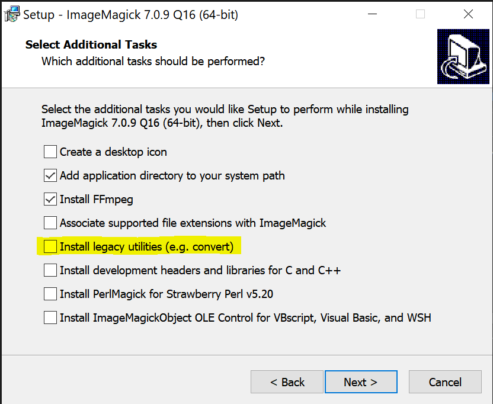

# Padoof
Organize your pdf library with ease and convenience.   
Add any information to your pdfs to make them easier to find, filter and sort.   
This is an open source desktop application for Windows, Mac and Linux.  
This is a fork of Mediachips, which was designed for videos.

## Requirements

Note: Imagemagick-CLI is rquired
  Download it and, on windows, MAKE SURE YOU CLICK INSTALL LEGACY UTILITIES (E.G. CONVERT)

  

One Mac, you can use `brew install imagemagick`